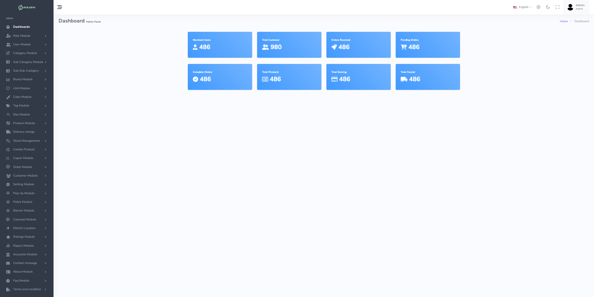
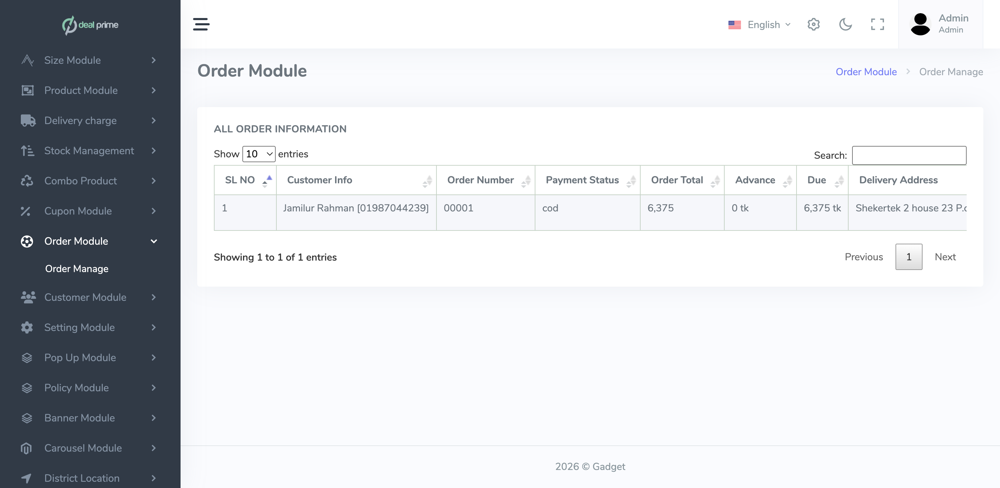

# DealPrime — E-commerce Platform (Laravel)
DealPrime is a full-stack e-commerce web application built with **Laravel 10** for product discovery, cart/checkout, customer accounts, and a role-based admin panel. The project includes Bangladesh-specific integrations like **SSLCommerz payment gateway**, **Pathao courier API**, and **SMS OTP** via **sms.net.bd**.

> Built during BITM Web Development training using Laravel.

---

## Key Features

### Storefront (Customer-facing)
- Product browsing by category + product details pages  
- Cart, wishlist, and compare list
- Coupon/discount apply flow
- Customer authentication flows (includes phone OTP support)
- Checkout flow with **SSLCommerz** online payment
- Order tracking page (search + status view)

### Admin Panel (Operations)
- Admin dashboard (Jetstream + Sanctum auth)
- **Role-based access control (RBAC)** using `spatie/laravel-permission`
- Catalog management:
  - Categories / subcategories / tags
  - Brands, colors, sizes, units
  - Products + stock management
  - Combo products / offers
- Order management + status updates
- Delivery settings:
  - Courier, districts, police stations
  - Delivery charges
- CMS modules:
  - Banners, carousel, popup
  - Blog + blog categories/tags
  - FAQs, about, policies/terms, contact messages
- Reports section (admin reporting pages)

### Integrations
- **SSLCommerz Payment** (Hosted checkout + success/fail/cancel + IPN validation)
- **Pathao Courier API**
  - city/zone/area lookup
  - create courier order from admin
- **SMS.net.bd**
  - OTP SMS sending
  - order/payment SMS notifications

---

## Tech Stack
- **Backend:** Laravel 10 (PHP 8.1+), Jetstream, Sanctum  
- **Frontend:** Blade + TailwindCSS + Vite  
- **DB:** MySQL  
- **Auth/RBAC:** Jetstream auth + `spatie/laravel-permission`  
- **Payments:** SSLCommerz  
- **Courier:** Pathao API  
- **SMS:** sms.net.bd API  

---

## Screenshots 





---

## Getting Started (Local Setup)

### 1) Requirements
- PHP **8.1+**
- Composer
- Node.js **18+** (recommended)
- MySQL

### 2) Clone & Install
```bash
git clone <YOUR_REPO_URL>
cd dealprime

composer install
npm install
